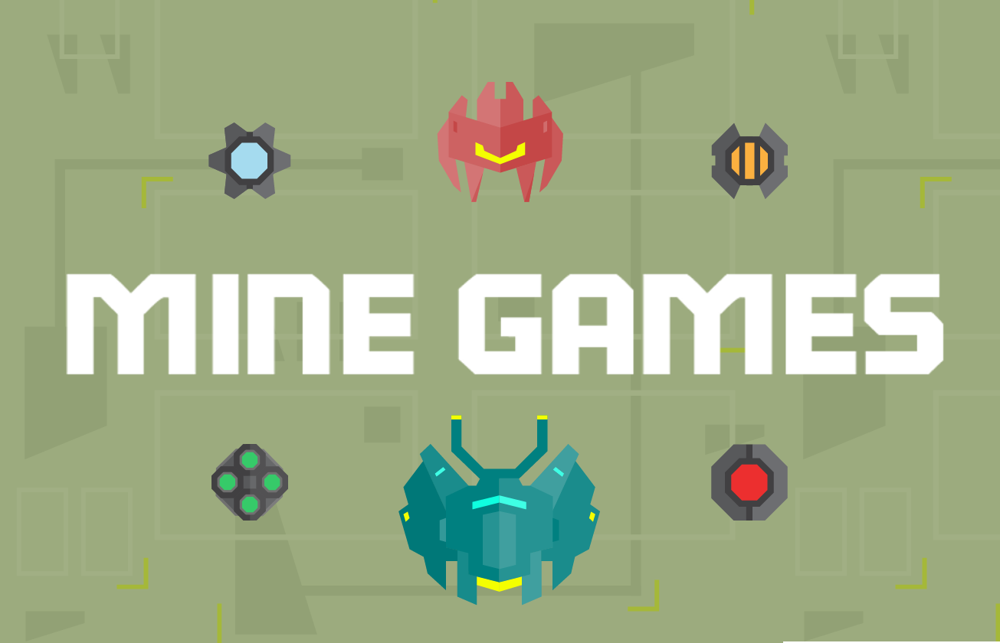
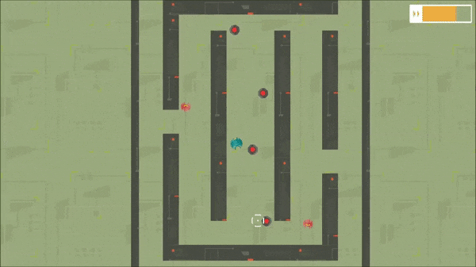
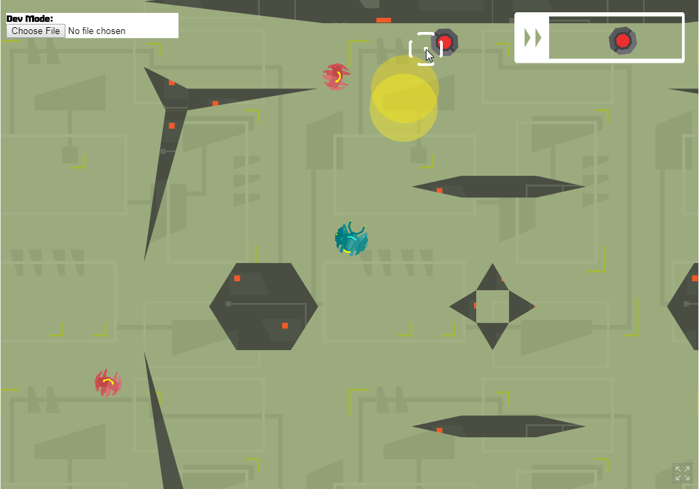
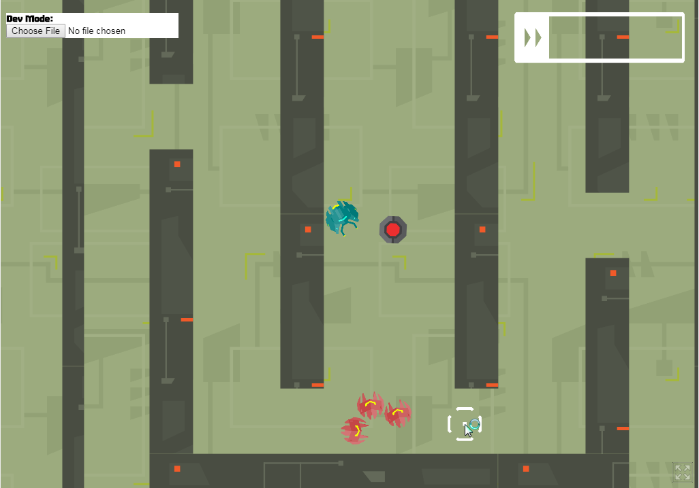

## You, Hordes of Robots. Unlimited Mines. Ultimate Destruction!

Blast your way through 7 unique levels in Mine Games, a top-down 2D shooter where mines are your friends and enemies. The player is a lowly minelayer bot tasked to defeat waves upon waves of hostile bots. Use mines to neutralize the opposition, but be careful; the mines you lay can and will blow you up!

### [Click Here to Play](https://danman113.itch.io/mine-games)

# Controls:
WSAD to move.

Click and hold to shoot mine

Shift to speed up

ESC and Enter to Pause

# Development

[Game code found here](demos/minegame)

[Engine code found here](src)
